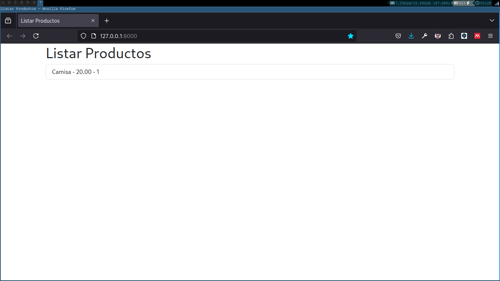

# Sistema de Inventario en Django



Este sistema es un ejemplo básico del uso de Django con el Sistema de Herencia de Plantillas llamado Jinja2.

## Requisitos

- Python 3.12 o superior
- Django 4.2 o superior

## Instalación

1. Clonar el repositorio
2. Crear un entorno virtual
3. Instalar las dependencias
4. Crear la base de datos
5. Correr el servidor
    
```bash
git clone
cd sistema_inventario
python -m venv env
source env/bin/activate
pip install -r requirements.txt
python manage.py migrate
python manage.py runserver
```

## Uso

El sistema cuenta con un CRUD de Productos y Categorías. Para acceder al panel de administración, se debe crear un superusuario.

```bash
python manage.py createsuperuser
```

## Licencia

MIT